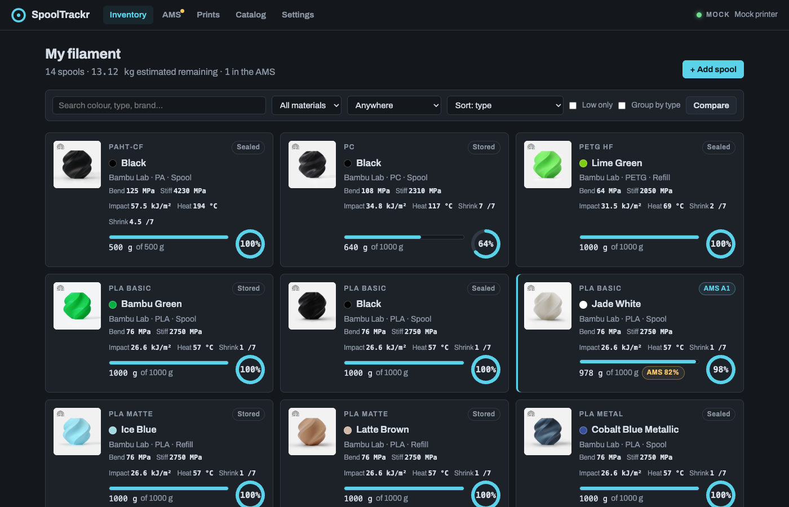
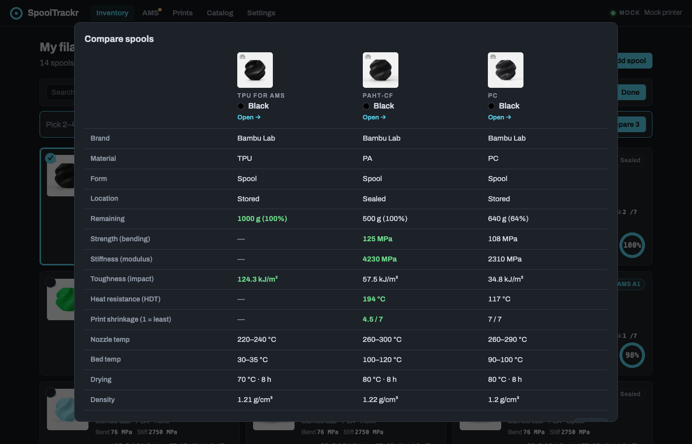
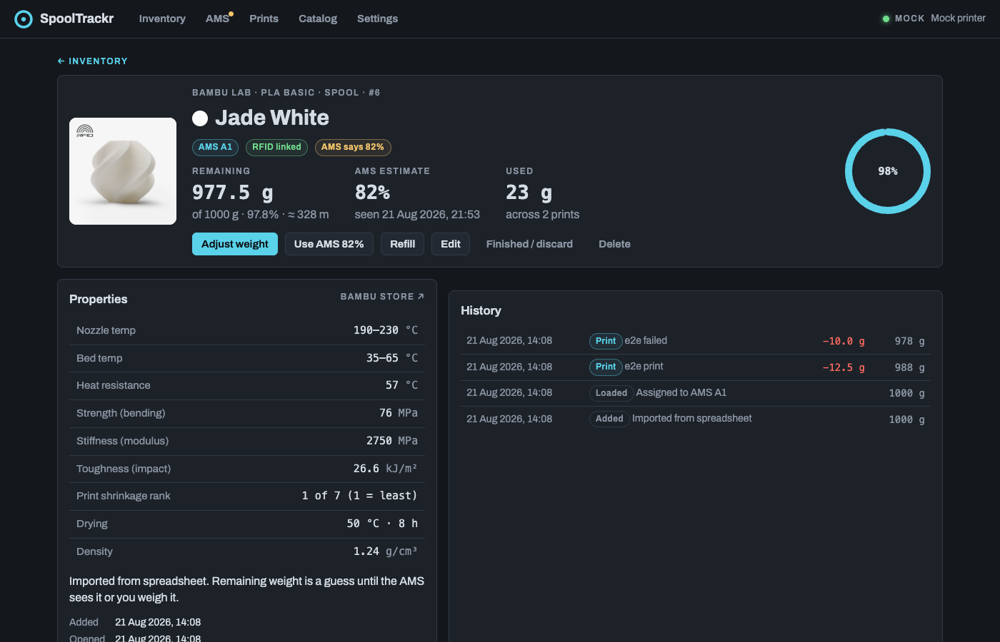
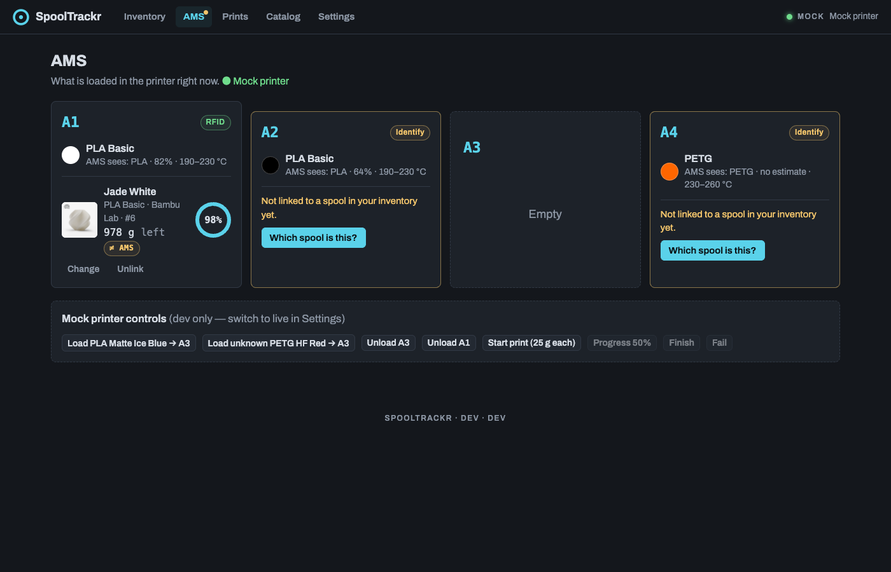
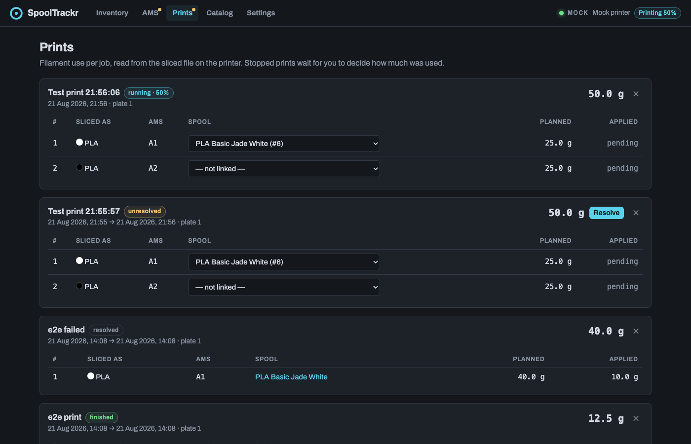
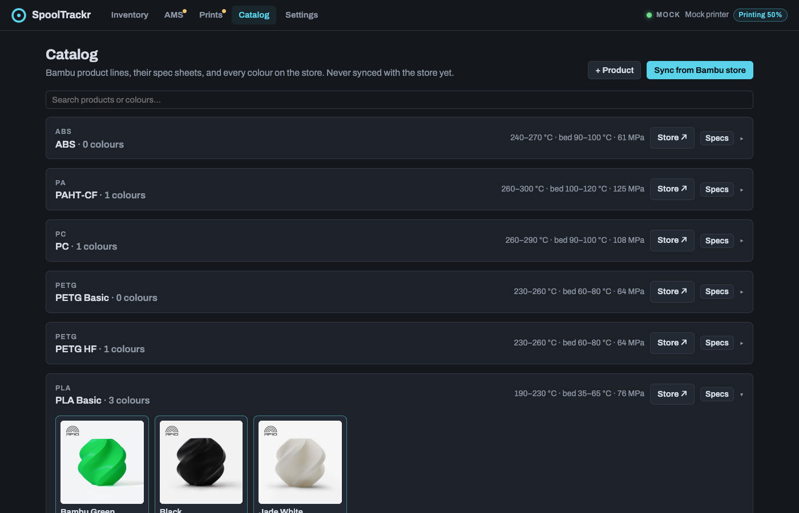
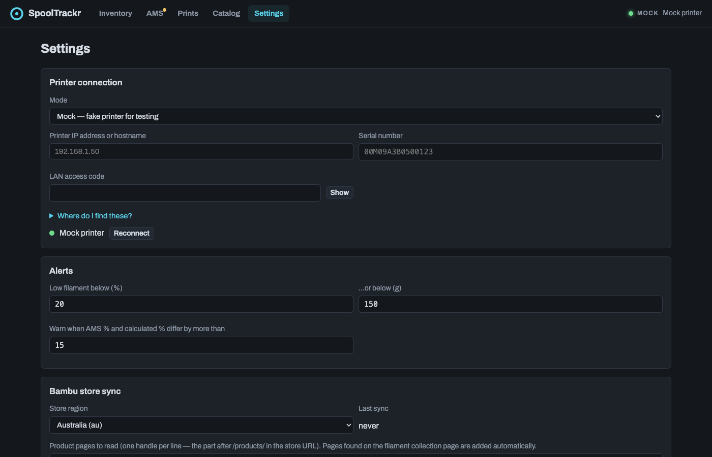

# SpoolTrackr

Filament inventory for Bambu Lab printers with an AMS. Every spool you own,
how much is left on it, its specs, and what is loaded in the printer right now,
kept up to date automatically from the printer over your LAN. No cloud, no login.

Works with any Bambu Lab printer that speaks the LAN-mode MQTT/FTPS protocol
(X1C is what it's developed on; P1/A1 series use the same protocol). One AMS
(four slots) is tracked.



## What it does

### Inventory
All your spools as cards: picture, colour, remaining grams and %, and the
material's spec chips (bending strength, stiffness, impact toughness, heat
resistance, print-shrinkage rank). Search, filter by material or location,
"low only", group by type, and sort by any spec. Low spools go amber, empty
ones red.

### Compare
Pick two to four spools and get them side by side. The best value in each row
is highlighted.



### Spool detail
Everything about one spool: remaining vs the AMS's own estimate, metres left,
the full spec sheet, and a history of every change (prints, refills, manual
adjustments). Adjust weight after you weigh it, refill, mark finished, or
one-click "use AMS %" when the two disagree.



### AMS, live
The four slots as the printer sees them. Bambu RFID spools are linked to your
inventory automatically. Third-party or un-chipped spools get a
"Which spool is this?" prompt with likely candidates.



### Prints
When a job starts, the sliced `.3mf` is pulled off the printer and its
per-filament usage is shown. When the job finishes, the grams are deducted
from the right spools. Stopped or failed prints wait for you to say how much
was actually used.



### Catalog
Bambu product lines with their spec sheets (temps, strength, drying, density)
and every colour, picture and price, synced from the Bambu store for your
region. Add your own products and edit any spec.



### Settings
Printer connection (mock or live), low-filament thresholds, the AMS-divergence
warning level, store region, and which store pages to read.



## Spec chips explained

| Chip | Meaning | Source |
|---|---|---|
| **Bend** | Bending strength, MPa. Higher = takes more load before breaking. | Bambu spec sheet |
| **Stiff** | Bending modulus, MPa. Higher = flexes less. | Bambu spec sheet |
| **Impact** | Notched impact toughness, kJ/m². Higher = survives knocks. | Bambu spec sheet |
| **Heat** | Heat deflection temp, °C. Higher = holds shape when hot. | Bambu spec sheet |
| **Shrink** | Print-shrinkage rank, 1 (least) to 7 (most). Lower = parts come off the bed closer to size. | Derived from the [Bambu wiki shrinkage order](https://wiki.bambulab.com/en/knowledge-sharing/3d-prints-shrinkage): PLA 1 · PETG 2 · ASA 3 · ABS 4 · PA 5 · PC 7, minus 0.5 for CF/GF-filled variants. A ranking, not a measurement. |

## How remaining weight is estimated

`remaining = starting weight − Σ slicer used_g of finished prints ± manual corrections`

The AMS's own % estimate is shown alongside, and you get a warning (plus a
one-click "use AMS" button) when the two disagree by more than the threshold.
Purge, prime towers and failed prints are not exact. Weigh a spool now and
then and hit **Adjust weight**.

## Stack

Vue 3 + Pinia · FastAPI (Python 3.12) · PostgreSQL 16 · MQTT + FTPS to the
printer · Docker. Design notes in [`docs/DESIGN.md`](docs/DESIGN.md).

## Run it locally (dev)

```bash
# database
docker run -d --name spooltrackr-dev-pg -e POSTGRES_USER=spool -e POSTGRES_PASSWORD=spool \
  -e POSTGRES_DB=spooltrackr -p 5433:5432 postgres:16-alpine

# backend (serves the API; also serves frontend/dist if it exists)
cd backend
python3 -m venv .venv && .venv/bin/pip install -r requirements-dev.txt
.venv/bin/uvicorn app.main:app --reload --port 8000

# frontend with hot reload (proxies /api to :8000)
cd frontend && npm install && npm run dev     # http://localhost:5173
```

First boot seeds the catalog and a starter set of spools, and starts a
**mock printer** so everything works without hardware (the AMS page gets a
row of buttons to load spools and run fake prints). Switch to **Live** in
Settings and enter the printer's IP, serial and LAN access code.

## Tests

```bash
cd backend && .venv/bin/python -m pytest          # parsers + end-to-end flow (needs the dev Postgres)
cd frontend && npm run build && npx playwright test   # browser tests against a running backend (fresh DB, mock mode)
```

## Deploy on the NAS

Single `docker compose` stack; pick a free LAN port (default 8322).

```bash
ssh <nas>
cd <apps-folder>
git clone https://github.com/Crypto69/spooltrackr.git && cd spooltrackr
chmod -R a+rX .
cp .env.example .env && vi .env      # printer IP / serial / access code, db password
./deploy.sh
```

Then open `http://<nas>:8322`. Postgres data lives in `./data/pg`.

Updates: `./deploy.sh` pulls `main`, rebuilds and restarts. If the NAS has no
real `git` binary on its PATH (TerraMaster TOS only exposes a shell alias),
the script borrows one from the `alpine/git` image. `./deploy.sh --no-pull`
builds whatever is checked out.

## Printer requirements

* Any Bambu Lab printer on the same LAN, ideally with a fixed IP.
* Printer screen → Settings → Network: IP address and **Access Code**.
* X1 series firmware 01.08+: enable **Developer Mode** so LAN MQTT/FTP are
  allowed (cloud binding can stay on). P1/A1: enable LAN Mode.
* The app connects to MQTT (`8883`, user `bblp`) and FTPS (`990`) using the
  access code.
